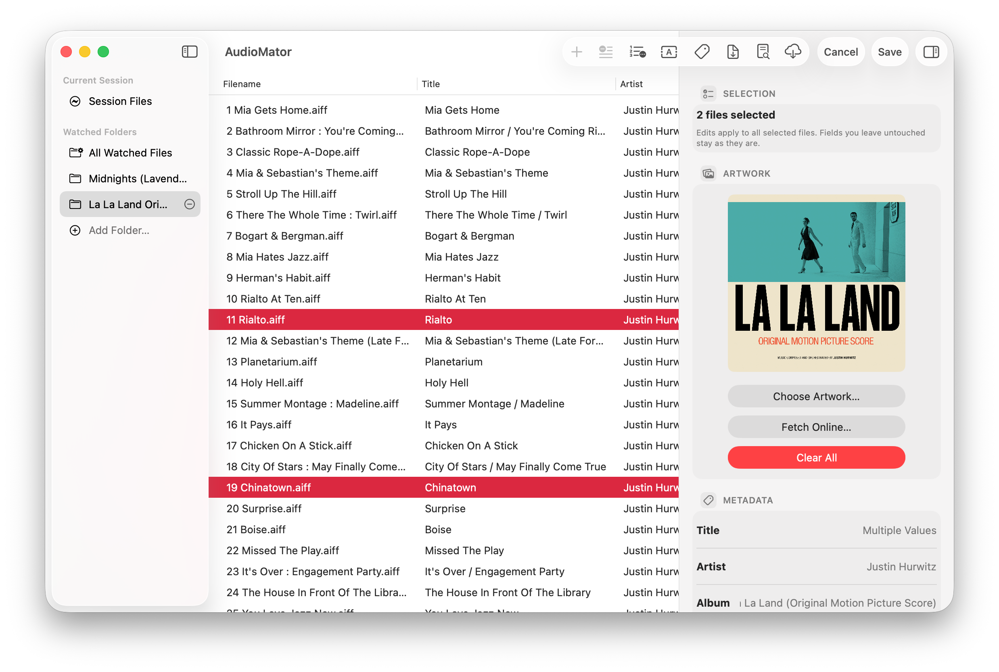

<p align="center">
  
</p>

<h1 align="center" style="font-size: 36px;">AudioMator</h1>

<p align="center">
  <strong style="font-size: 24px;">Your Audio Library’s Best Mate</strong><br>
  Native Audio Metadata Editor
</p>

<p align="center">
  <a href="#building">
    
  </a>
</p>


## Overview

AudioMator is a local-first audio metadata workbench for inspecting, organizing, and editing music libraries. It supports workflows such as bulk tag editing, artwork replacement, filename-based metadata import/export, raw metadata inspection, and retrieving metadata from online sources for automatic tagging. Built as a native application, AudioMator adopts platform-specific behavior where appropriate: on macOS, it provides a desktop-style workflow with watched folders, a multi-pane interface, and Finder-style file actions, while on iPadOS it follows a document-based workflow designed around sandboxed file access and touch interaction. AudioMator uses TagLib for audio metadata reading, writing, artwork handling, raw property inspection, and format capability discovery, with metadata changes flowing through a shared pipeline so the inspector, batch tools, online tagging workflows, filename operations, and raw metadata editor remain behaviorally consistent.

## Screenshot

<p align="center">
  
</p>

## Product Capabilities

### Local metadata editing

- Open audio files directly into the current session.
- Edit a single file in the inspector.
- Select multiple files and apply only the fields you intentionally change.
- Save title, artist, album, album artist, composer, genre, year, release date, publisher, copyright, explicit status, track/disc numbering, and other supported fields.

### Artwork management

- Preview embedded artwork in the inspector.
- Import artwork from clipboard / Photo Library / Finder.
- Clear artwork from one file or from a selected group.
- Search online artwork through the iTunes artwork workflow when you explicitly ask for it.

### Batch utilities

- Renumber track numbers using the visible list order.
- Choose ascending or descending numbering.
- Start from a custom number.
- Preserve or add zero padding where appropriate.
- Rename files from metadata with a token-based template.
- Extract metadata from filenames with a matching template.
- Validate rename conflicts before moving files.
- Keep file extensions unchanged when generating new filenames.

### Online tagging

- Search online metadata sources through MusicBrainz, iTunes, and LRCLIB.
- Search from selected files using existing tags and filename fallback.
- Review recordings, releases, media, track lists, identifiers, dates, artist credits, labels, catalog numbers, countries, genres, tags, ratings, and relationships before applying.
- Use the tagging workbench to map selected files to release tracks.
- Search LRCLIB for synced lyrics candidates from selected track metadata.
- Review LRCLIB candidates one track at a time, with synced/plain-only state shown before applying lyrics.
- Apply chosen fields back to local files through the same metadata write path used by the inspector.

### Inspection and raw metadata tools

- View normalized tags in the main list and inspector.
- Configure visible middle-list columns.
- Sort columns while preserving manual order fallback.
- View duration, bitrate, sample rate, channel count, and detected format.
- Open a raw metadata dump for detailed inspection.
- Use the Metadata Editor to inspect and edit raw TagLib property-map keys for one file or a selection.
- Add fields from known metadata suggestions in the raw editor.
- See mixed values in multi-file raw metadata editing.

## Platform Model

### macOS

The macOS build is the full desktop workflow:

- Current Session import for one-off work.
- Persistent watched folders with automatic rescans.
- Sidebar, middle list, and inspector in a native three-pane window.
- Dedicated windows for Online Metadata, Filename & Metadata, and Metadata Editor.
- File-path display in the inspector.
- Finder-style actions such as reveal in Finder, open with the default app, and copy path.
- Configurable toolbar buttons.
- Configurable list columns.
- Settings tabs for General, Toolbar, Columns, and About.

### iPadOS

The iPadOS build intentionally avoids pretending to be macOS:

- Session-only document workflow.
- No persistent watched folders.
- No desktop-style sidebar.
- Content + inspector workspace optimized for touch.
- Tools appear as in-page sheets instead of extra windows.
- Document picking uses security-scoped access during the active session.
- File-path presentation is hidden where it does not fit iPadOS.
- Settings focus on iPad-specific list metadata and About information.

> [!IMPORTANT]
> #### About iPadOS Support
>
> I do not have an Apple Developer Program membership and there are currently no plans to commercialize AudioMator. The iPadOS version is being developed separately from the macOS release cycle and should be considered more of a personal side project and platform experiment rather than a feature-parity target.

## Track And Disc Number Handling

AudioMator treats track and disc data as structured metadata instead of a single loose string. These fields are first-class throughout the inspector, batch editor, filename tools, MusicBrainz write-back, and write verification path:

- `Track Number`
- `Total Tracks`
- `Disc Number`
- `Total Discs`

This matters because common containers do not all store numbering the same way. A user may enter `02/09`, but the file format may represent that as numeric track `2`, numeric total `9`, and possibly a separate text form. AudioMator preserves both numeric intent and user-facing text intent where the container and bridge support it.

### Write behavior

- ID3v2-style formats use canonical `TRCK` and `TPOS` values.
- PropertyMap-style formats use `TRACKNUMBER`, `TRACKTOTAL`, `DISCNUMBER`, `DISCTOTAL`, and compatible aliases where needed.
- MP4/M4A writes standard `trkn` and `disk` numeric pairs.
- MP4/M4A also uses internal freeform preservation data where available so formatting such as zero padding can survive a round trip.
- Post-write verification compares numeric values and text forms separately so a harmless container normalization is reported differently from a real write mismatch.

## Supported Formats

AudioMator discovers readable and writable extensions from the `TagLibAudioMetadata` package at runtime. Current supported readable extensions include:

`mp3`, `mp2`, `m4a`, `m4b`, `m4p`, `mp4`, `aac`, `ogg`, `opus`, `mpc`, `wma`, `asf`, `spx`, `flac`, `ape`, `wv`, `tta`, `wav`, `aiff`, `aif`, `dsf`, `dff`, `oga`

Format-specific behavior still depends on the underlying container and tag implementation. Raw property-map support is the widest common surface. Some module/tracker formats may be treated as metadata-only writable formats for artwork purposes when the package reports that capability.

## Privacy And Network Use

AudioMator is local-first. Core editing, raw inspection, filename tools, batch editing, renumbering, and local artwork replacement run on the device.

Network access happens only when you explicitly use an online feature:

- MusicBrainz lookup and tagging contacts `musicbrainz.org`.
- iTunes metadata and artwork lookup contacts the Apple iTunes Search API at `itunes.apple.com` and Apple artwork CDN hosts.
- LRCLIB synced lyrics lookup contacts `lrclib.net`.
- Release-note lookup may contact `api.github.com`.
- Manual update checks on macOS contact GitHub Releases through `api.github.com` to read the latest AudioMator release tag and version metadata.

AudioMator does not upload the audio file contents for ordinary metadata editing. Online lookup features may send search terms derived from metadata or user input, such as title, artist, album, album artist, track number, duration, ISRC, barcode/UPC, iTunes album/artist/track IDs, MusicBrainz identifiers, pasted MusicBrainz/Apple Music/iTunes links, storefront country, or manually entered queries.

See `ACKNOWLEDGEMENTS_AND_PRIVACY.md` for the detailed disclosure.

## Manual Update Checks

The macOS app includes a lightweight **Check for Updates...** flow. AudioMator asks the GitHub Releases API for the latest published release, compares the release tag with the app's current version, and opens the GitHub Releases page when you choose to download an update.

AudioMator release tags must use the form `V<version>B<build>`, for example `V2.3B26512`. The update checker compares only the version part before `B`; the build number is ignored. Version parts are compared as integer segments, so `2.10` is newer than `2.9`, and `2.2` is newer than `2.1.20`.

This flow does not install updates, download archives in the background, perform delta updates, or require code signing or notarization. Sparkle infrastructure remains dormant for macOS. The app does not start Sparkle at launch and does not link `Sparkle.framework` unless `ENABLE_SPARKLE_UPDATES` is added and the Sparkle package product is linked back into the app target.

## TagLib Bridge Smoke Testing

The repository includes a lightweight bridge regression tool under `scripts/`. It is intended for local bridge/package debugging and may require the expected TagLib bridge source layout to be available in your checkout.

```bash
bash scripts/build-taglib-bridge-smoke.sh
./.tmp/taglib_bridge_smoke read path/to/file.m4a
./.tmp/taglib_bridge_smoke raw path/to/file.m4a
./.tmp/taglib_bridge_smoke write-track path/to/file.m4a 07/12 2/3
./.tmp/taglib_bridge_smoke write-roundtrip path/to/file.m4a
```

This tool is intended for bridge-level debugging, especially around:

- track/disc totals
- MP4 `trkn` / `disk` behavior
- text-preservation vs numeric readback
- raw property-map inspection

## Contact

E-mail: AudioMator@lloydME.com

## Repository Layout

- `AudioMator/`
  The app source.
- `AudioMator/App/`
  App entry point, commands, notifications, and platform delegates.
- `AudioMator/Core/`
  Shared platform compatibility, network disclosure, and audio-format support.
- `AudioMator/Domain/`
  Metadata pipeline models, audio-file models, rename templates, file sources, track renumbering, and UI state.
- `AudioMator/Features/`
  SwiftUI feature areas for the main window, iPad workspace, online metadata browser, provider-specific metadata and lyrics browsers, metadata editor, settings, filename tools, metadata inspector, and welcome flow.
- `AudioMator/Infrastructure/`
  File-system monitoring, MusicBrainz, iTunes Search API/artwork, LRCLIB lyrics lookup, GitHub release-note services, and macOS manual update checks.
- `Config/`
  Project configuration inputs, including the app Info.plist.
- `scripts/`
  Build and smoke-test helpers.
- `README.md`
  Product and developer overview.
- `ACKNOWLEDGEMENTS_AND_PRIVACY.md`
  Network/privacy notes and third-party acknowledgements.
- `THIRD_PARTY_NOTICES.md`
  Third-party license notices.
